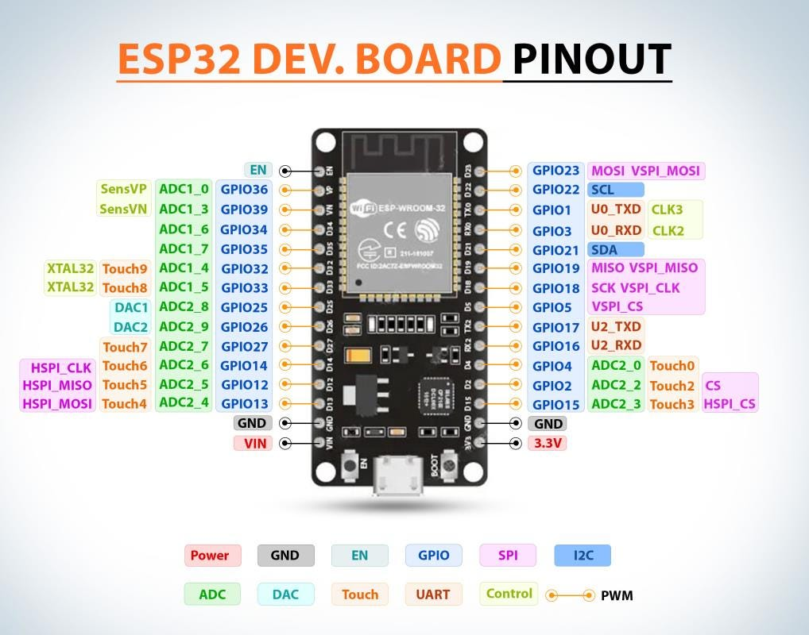
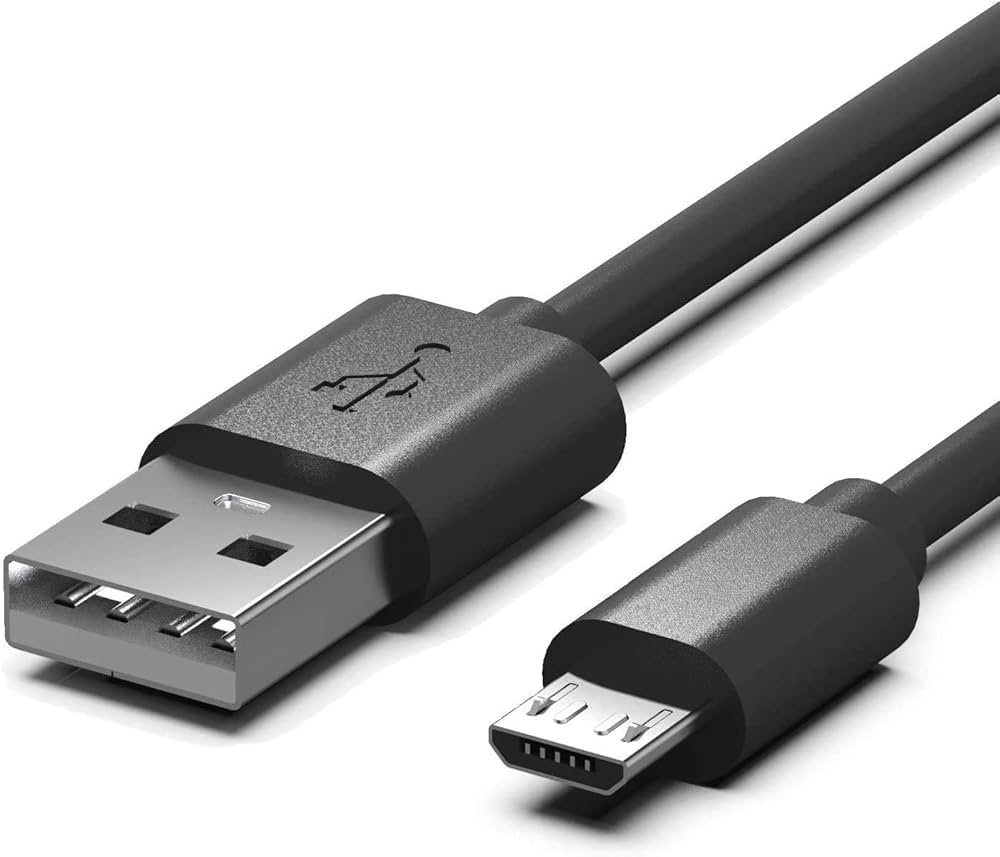

# MarauderZ for Windows PC

**MarauderZ** is an ESP32-based WPA/WPA2 handshake and PMKID capture
toolkit, purpose-built to run natively on a Windows PC — capture and
cracking both happen on Windows, no separate Linux box or monitor-mode
adapter required. It's a substitute for `airodump-ng`/`aireplay-ng` on
hardware (e.g. Raspberry Pi, most laptops) whose onboard WiFi chip
doesn't support monitor mode or packet injection — the ESP32 does the
over-the-air work instead, and your Windows PC does the offline cracking
with `hashcat`.

A Linux/Raspberry Pi version of this same workflow is documented in
[`HANDSHAKE_TUTORIAL.md`](docs/HANDSHAKE_TUTORIAL.md), but Windows is this
project's main target: this document is the primary, actively-maintained
workflow, with a GUI built specifically for it (see below).

<p align="center"></p>

> **Before you start:** anything written in *italics* in this document
> (e.g. *your-network-ssid*, *your-com-port*) is a placeholder — replace
> it with your own value before running that command. Nothing in italics
> is meant to be copy-pasted literally.

## GUI vs CLI

Every step below can be run either as a command you type, or as a button
in a desktop app — pick whichever you're comfortable with, they drive
the exact same underlying logic:

- **GUI** — `python gui.py` opens a tabbed window (Flash / Capture /
  Convert / Inspect & Isolate / Crack / Results) with a browse button for
  every file path and a COM-port dropdown, so nothing needs to be typed
  by hand. Recommended if you're new to the command line.
- **CLI** — the numbered steps below, run directly in PowerShell. Gives
  you the raw commands and output, useful for scripting or if you just
  prefer a terminal.

Both need the same prerequisites (Python 3 + pyserial); the GUI adds no
extra dependency, since it's built on Python's built-in `tkinter`.

### Using the GUI (quick steps)

`python gui.py`, then work through the tabs left to right — every
default path already points at `downloads/` or `captures/`, and every
Browse dialog opens there too, so there's rarely anything to type:

1. **Flash** — set the COM port (or Refresh to find it), Compile + Upload.
2. **Capture** — Start Terminal, click your network in the live table,
   Select This Network, watch for EAPOL frames, then Stop Terminal.
3. **Convert** — Option A (opens the web converter) or Option B
   (converts locally via WSL) to turn the `.pcap` into a `.hc22000` file.
4. **Inspect & Isolate** — List Entries, click your network's row,
   Isolate Selected Network.
5. **Crack** — browse to hashcat.exe, the isolated hash file, and a
   wordlist, then Start Cracking.
6. **Results** — the recovered password (or "no password found") shows
   immediately as a popup and a large banner, and stays browsable in the
   Results tab afterwards.

The numbered CLI steps below cover the same six stages in more detail —
each one's `*GUI: ...*` note points back to the matching tab/button.

## Legal & Ethical Use

**This project sends real deauthentication frames and attempts real
authentication against a live access point. Only ever target a network
and clients you own, or have explicit written authorization to test.**
Deauth frames disconnect *every* client on the selected network while the
sketch is running, not just a test device — including a wrong network
you accidentally pick. Unauthorized use against networks you don't own
or lack permission to test is illegal in most jurisdictions. The scan
list order is not stable between runs; always verify the SSID text, not
just its position in the list, before selecting a target.

## How It Works

The ESP32 runs two attacks in a loop against a single AP you select from
a live scan:

1. **Deauthentication** — broadcasts spoofed deauth frames (as the AP) so
   that connected clients disconnect and reconnect, producing a genuine
   4-way EAPOL handshake. This works around Espressif's WiFi library
   normally blocking raw deauth frames from the STA interface, using the
   same technique as the [ESP32Marauder](https://github.com/justcallmekoko/ESP32Marauder)
   project (overriding `ieee80211_raw_frame_sanity_check()` and
   transmitting via `WIFI_IF_AP`).
2. **PMKID capture** — attempts to associate to the target AP with a
   throwaway password. On routers that support PMKID caching, the AP's
   first EAPOL reply includes a PMKID before the password is even
   checked — crackable with hashcat just like a full handshake, since
   both derive from the same PSK. This step alone never disconnects
   anyone.

Any EAPOL frame the ESP32 observes (a real handshake, or its own PMKID
attempt) is hex-dumped over serial and reconstructed into a real `.pcap`
by [`capture_handshake.py`](capture_handshake.py). From there,
`hashcat` verifies candidate passwords completely offline — no further
contact with the AP required. That makes password *strength* the entire
game: if a wordlist or mask attack cracks it, the password was the weak
point, not any implementation flaw in WPA2.

## Hardware Requirements

| Component | Notes |
|---|---|
| <br>ESP32-WROOM-32 development board | Any ESP32-WROOM-32 DevKit board works. [Datasheet](https://www.espressif.com/sites/default/files/documentation/esp32-wroom-32_datasheet_en.pdf) |
| <br>USB data cable | Must support data, not just power (micro-USB or USB-C depending on your board) |
| USB-to-UART bridge driver | Most DevKit boards use a Silicon Labs CP2102/CP2104 or WCH CH340 chip. Windows needs the matching driver installed before the board shows up as a COM port — see [Software Prerequisites](#software-prerequisites) below |
| Windows PC | With a spare USB port and, ideally, a dedicated GPU for faster cracking (see hashcat below) |

## Software Prerequisites

| Tool | Purpose | Download |
|---|---|---|
| Python 3 | Runs `capture_handshake.py` and `list_hc22000.py` | [python.org/downloads/windows](https://www.python.org/downloads/windows/) |
| pyserial | Python package for serial/COM port I/O | installed via `pip` (below) |
| Arduino CLI *(only needed if (re)flashing the sketch)* | Compiles/uploads the `.ino` sketch to the ESP32 | [arduino.github.io/arduino-cli](https://arduino.github.io/arduino-cli/latest/installation/) |
| ESP32 Arduino core | Board support package for Arduino CLI | [github.com/espressif/arduino-esp32](https://github.com/espressif/arduino-esp32) |
| CP210x USB-to-UART driver | Lets Windows recognize the ESP32 as a COM port | [Silicon Labs CP210x VCP drivers](https://www.silabs.com/developer-tools/usb-to-uart-bridge-vcp-drivers) |
| 7-Zip | Extracts the hashcat release archive (`.7z`) | [7-zip.org](https://www.7-zip.org/) |
| hashcat | Offline password cracking against the captured hash | [hashcat.net/hashcat](https://hashcat.net/hashcat/) |
| hcxtools *(optional — see [Step 3](#step-3--convert-the-capture-to-hashcats-format))* | Converts `.pcap` → hashcat's `.hc22000` format | [github.com/ZerBea/hcxtools](https://github.com/ZerBea/hcxtools) (via WSL) |
| WSL2 + Ubuntu *(optional, only for the hcxtools route)* | Runs Linux-only tooling on Windows | [learn.microsoft.com/windows/wsl/install](https://learn.microsoft.com/en-us/windows/wsl/install) |
| Wordlist | Dictionary attack input | [rockyou.txt](https://github.com/brannondorsey/naive-hashcat/releases/download/data/rockyou.txt) — ~14M passwords from a public breach corpus |

> **Note on `python`/`python3` shadowing:** on some Windows setups, the
> `python`/`python3` commands resolve to the Microsoft Store's app
> execution alias stub and print `Python was not found` even after a
> real Python install exists. If that happens, either run Python via its
> full install path, or disable the alias under
> **Settings → Apps → Advanced app settings → App execution aliases**.

Install the one Python dependency:

```powershell
pip install pyserial
```

Save `hashcat-*version*.7z` (from hashcat.net) and `rockyou.txt` into
`downloads\` (see [Project Structure](#project-structure) below) — that's
where the GUI and the commands in this doc expect them by default.

## Project Structure

```
esp32-wifi/
├── README.md                       # this file - rendered on GitHub, canonical copy
├── docs/
│   ├── HANDSHAKE_TUTORIAL.md        # Linux / Raspberry Pi workflow
│   └── WINDOWS_HANDSHAKE_TUTORIAL.md   # detailed copy of this file
├── firmware/
│   ├── MarauderZ_sniffer/
│   │   └── MarauderZ_sniffer.ino         # main sketch: scan, deauth, PMKID capture, serial EAPOL dump
│   └── deauth_only/
│       └── deauth_only.ino          # deauth-only variant
├── capture_handshake.py             # CLI: interactive serial capture -> captures/handshake.pcap
├── list_hc22000.py                  # CLI: lists BSSID/ESSID of every entry in a .hc22000 file
├── gui.py                           # GUI: wraps every step below behind buttons/browse dialogs
├── downloads/                       # gitignored - third-party downloads (see above)
│   ├── hashcat-*version*/
│   └── rockyou.txt
└── captures/                        # gitignored - your own run output (created automatically)
    ├── handshake.pcap
    ├── *.hc22000
    └── cracked.txt
```

`downloads/` and `captures/` aren't part of the source - they're
gitignored working folders for things you download (hashcat, the
wordlist) and things you generate by running the tool (captures, cracked
passwords). Both are created automatically the first time you run
`gui.py`, so a freshly cloned copy of this repo doesn't need them
pre-created.

## Step 1 — Flash the Sketch

*GUI: "1. Flash" tab — has its own COM port dropdown now, shared with
the Capture tab.*

Skip this step only if the board is already flashed with the *current*
version of the sketch. If your board was flashed before `MarauderZ_sniffer.ino`
gained the `STOP` serial command (see [Step 2](#step-2--capture-the-handshake)),
reflash it — otherwise the GUI's Stop button has nothing to talk to and
only the hardware-reset Start button will do anything.

```powershell
arduino-cli core install esp32:esp32
cd firmware\MarauderZ_sniffer
arduino-cli compile --fqbn esp32:esp32:esp32 .
arduino-cli upload -p *your-com-port* --fqbn esp32:esp32:esp32 .
```

Find *your-com-port* (e.g. `COM3`, `COM7` — it will differ per machine)
in **Device Manager → Ports (COM & LPT)** after plugging the board in.

> If compiling fails with `multiple definition of
> 'ieee80211_raw_frame_sanity_check'`, the ESP32 core install is missing
> the linker flag the deauth workaround depends on. Create
> `platform.local.txt` next to `platform.txt` in your ESP32 core install
> (typically
> `%LOCALAPPDATA%\Arduino15\packages\esp32\hardware\esp32\<version>\`)
> containing one line:
> `compiler.c.elf.extra_flags=-Wl,--allow-multiple-definition`

## Step 2 — Capture the Handshake

*GUI: "2. Capture" tab — pick your COM port from the dropdown, browse to
an output .pcap, click **Start Terminal** (opens the serial connection —
note this locks the COM port so nothing else, e.g. the Arduino Serial
Monitor, can open it at the same time; click **Stop Terminal** to release
it). Scanned networks populate a table live; click a row and **Select
This Network** (or double-click it) instead of typing a number by hand.
Two more buttons appear once the terminal is running: **Start** performs
a hardware reset (toggles the board's reset line) so the sketch runs from
the very beginning again with a fresh scan, and **Stop** sends the
firmware's `STOP` command, which halts the deauth burst/PMKID attempts
and switches off packet capture without resetting the board or losing
the serial session — requires the current sketch (see
[Step 1](#step-1--flash-the-sketch)).*

```powershell
python capture_handshake.py *your-com-port* 115200 captures\handshake.pcap
```

All three arguments are optional and already default to `COM30`,
`115200`, and `captures\handshake.pcap` (edit the defaults near the top
of `capture_handshake.py` to match *your-com-port*), so
`python capture_handshake.py` with no arguments works out of the box on
a matching setup.

The ESP32's live scan results print to the terminal, e.g.:

```
#   SSID                             CH  RSSI  ENC            BSSID
1   your-network-name                9   -46   WPA2-PSK       AA:BB:CC:DD:EE:FF
2   some-other-network               9   -58   WPA2-PSK       11:22:33:44:55:66

Type the number of the network to target, or 'r' to rescan:
```

**Read the SSID text, not just the number** and confirm it's
*your-network-ssid* (the network you own or are authorized to test),
then type its number and press Enter. From here the ESP32, on
independent schedules, continuously:

1. Locks onto that network's channel in promiscuous mode
2. Every 2 seconds, sends a burst of 10 deauth frames to broadcast
3. Every 15 seconds, attempts to associate to the AP for PMKID capture
4. Hex-dumps any EAPOL frame it sees over serial, which the script
   decodes into `captures\handshake.pcap`

Watch for a run of EAPOL frames (ideally 4 in a row — a full M1–M4
handshake from a reconnecting client). Once you see that, press
**Ctrl+C in the Python script** to finalize the `.pcap`. This only stops
capture on the PC side — the ESP32 itself keeps running until reset or
reflashed (see [Cleanup](#cleanup)).

## Step 3 — Convert the Capture to hashcat's Format

*GUI: "3. Convert" tab — has a button for each option below. For Option
B, choose the save location before converting; once `hcxpcapngtool`
finishes, the GUI confirms with a popup showing exactly where the
`.hc22000` file was saved.*

`hcxpcapngtool` (from hcxtools) has no native Windows build, so pick one:

### Option A — hashcat.net's `cap2hashcat` web converter (fastest, no install)

1. Open [hashcat.net/cap2hashcat](https://hashcat.net/cap2hashcat/)
2. Upload `captures\handshake.pcap`
3. Download the resulting `*your-hash-file*.hc22000` file into
   `captures\` (the filename is auto-generated, e.g.
   `12345_1699999999.hc22000`)

This uploads your capture to a third-party server — acceptable for a
throwaway test against your own network, but use Option B instead if the
capture might contain anything sensitive.

### Option B — hcxtools offline via WSL (fully local)

```powershell
wsl --install -d Ubuntu    # one-time, skip if a distro is already installed
wsl -d Ubuntu -- sudo apt update
wsl -d Ubuntu -- sudo apt install -y hcxtools
wsl -d Ubuntu -- hcxpcapngtool -o /mnt/*your-project-path*/captures/handshake.hc22000 /mnt/*your-project-path*/captures/handshake.pcap
```

Translate your Windows path to WSL's mount convention, e.g.
`D:\Projects\esp32-wifi` → `/mnt/d/Projects/esp32-wifi`.

## Step 4 — Inspect the Hash File

*GUI: "4. Inspect & Isolate" tab (top section) — browse to the file,
click List Entries. Results populate a table, not just a log.*

Check what networks are actually in the resulting file — useful if
you've captured against multiple networks over time and entries have
accumulated:

```powershell
python list_hc22000.py captures\*your-hash-file*.hc22000
```

Output looks like:

```
line 0: BSSID=aabbccddeeff  ESSID=your-network-name
```

Set the `HC22000_PATH` constant near the top of `list_hc22000.py` to
your own filename to avoid retyping the path every time, or keep passing
it as an argument.

## Step 5 — Isolate Your Target (only if multiple SSIDs are present)

*GUI: "4. Inspect & Isolate" tab (bottom section) — after List Entries,
click a row in the table and then "Isolate Selected Network" (or just
double-click the row). No manual hex-encoding needed.*

Hex-encode *your-network-ssid* (e.g. `mynetwork` →
`6d796e6574776f726b` — any online "text to hex" converter, or Python's
`"mynetwork".encode().hex()`, will do this), then filter to just that
entry:

```powershell
Select-String "*your-ssid-hex*" captures\handshake.hc22000 | ForEach-Object { $_.Line } | Set-Content captures\target-network.22000
```

or with `findstr`:

```powershell
findstr "*your-ssid-hex*" captures\handshake.hc22000 > captures\target-network.22000
```

Always crack the isolated per-network file, never a raw file containing
multiple SSIDs, so you never end up attacking a network beyond what you
selected and are authorized to test.

## Step 6 — Install hashcat

```powershell
cd downloads
*path\to\7-Zip*\7z.exe x hashcat-*version*.7z -y
```

## Step 7 — Crack It

*GUI: "5. Crack" tab — browse to hashcat.exe, the hash file, and the
wordlist, then click Start Cracking. The two gotchas below are already
handled for you (it runs from the right folder automatically, and
streams output live instead of hanging). Once done, "Save cracked.txt
As..." saves a copy wherever you like and automatically loads that same
path into the Results tab. When the run finishes, a popup and a large
result banner in the tab itself immediately show either the recovered
password or "No password found in the wordlist" — this checks
`hashcat --show` under the hood, so it's correct even when the password
was already cracked in an earlier run (hashcat's potfile shortcut skips
writing `-o` in that case, but the GUI catches it and reports/saves the
result anyway) — no need to dig through the log.*

> **Gotcha 1:** run `hashcat.exe` from *inside its own extracted folder*.
> It resolves its `OpenCL\` and `kernels\` directories relative to the
> current working directory, not relative to the executable's path.
> Invoking it via a relative path from elsewhere fails immediately with
> `./OpenCL/: No such file or directory`.
>
> **Gotcha 2:** redirect output to a log file with `>` rather than piping
> through `head`/`Select-Object -First`. hashcat's live status screen can
> appear to hang indefinitely when piped.

```powershell
cd downloads\hashcat-*version*
.\hashcat.exe -m 22000 ..\..\captures\target-network.22000 ..\rockyou.txt -o ..\..\captures\cracked.txt
```

To also try common mutations (leetspeak, appended digits, capitalization):

```powershell
.\hashcat.exe -m 22000 ..\..\captures\target-network.22000 ..\rockyou.txt -r rules\best64.rule -o ..\..\captures\cracked.txt
```

To brute-force a specific pattern instead of a wordlist (e.g. an 8-digit
numeric password):

```powershell
.\hashcat.exe -m 22000 ..\..\captures\target-network.22000 -a 3 ?d?d?d?d?d?d?d?d -o ..\..\captures\cracked.txt
```

## Step 8 — Check Results

*GUI: "5. Crack" tab's "Show Cracked (--show)" button, or the
"6. Results" tab to browse and view `cracked.txt` directly.*

```powershell
cd downloads\hashcat-*version*
.\hashcat.exe -m 22000 ..\..\captures\target-network.22000 --show
```

or read the output file directly — format is
`PMKID/MIC:AP-MAC:client-MAC:ESSID:password`:

```powershell
type ..\..\captures\cracked.txt
```

## Interpreting Results

| Outcome | Meaning |
|---|---|
| Cracked in seconds/minutes against `rockyou.txt` | Password is a known/common one. Change it. |
| Cracked only with rules/mutations | A common word/pattern with minor tweaks. Still weak — change it. |
| Not cracked after wordlist + rules + reasonable brute-force | Behaving as expected for WPA2-PSK. A long (16+ character), random passphrase remains the strongest option regardless. |

## Example Session (illustrative — your values will differ)

```powershell
# 1. Capture
python capture_handshake.py

# 2. Convert (via hashcat.net cap2hashcat) -> captures\*your-hash-file*.hc22000

# 3. Inspect — confirm it's your target network before cracking
python list_hc22000.py captures\*your-hash-file*.hc22000
# -> line 0: BSSID=aabbccddeeff  ESSID=your-network-name

# 4. Crack
cd downloads\hashcat-*version*
.\hashcat.exe -m 22000 ..\..\captures\*your-hash-file*.hc22000 ..\rockyou.txt -o ..\..\captures\cracked.txt
```

hashcat auto-detects your GPU and picks the fastest available backend
(CUDA if the NVIDIA CUDA SDK Toolkit is installed, otherwise it falls
back to OpenCL automatically — either works fine for this attack). If
cracked, `cracked.txt` will contain a line like:

```
<hash>:<ap-mac>:<client-mac>:your-network-name:<recovered-password>
```

If the recovered password is a plain dictionary word or a common
pattern, that's a weak password — replace it with a long (16+ character)
random passphrase not derived from any dictionary word.

## Troubleshooting

- **`hashcat.exe` fails with `./OpenCL/: No such file or directory`** —
  you ran it from outside its own folder. `cd` into the extracted
  hashcat directory first.
- **hashcat appears to hang with no output** — you likely piped its
  output through a command that buffers or truncates (e.g. `head`).
  Redirect to a file with `>` instead and read the file separately.
- **`arduino-cli` compile fails with `multiple definition of
  'ieee80211_raw_frame_sanity_check'`** — see the note at the end of
  [Step 1](#step-1--flash-the-sketch); the ESP32 core install is missing
  `platform.local.txt`.
- **`cracked.txt` doesn't get created even though hashcat says
  "Cracked"** — if the hash was already cracked in an earlier run,
  hashcat serves the result from its potfile and skips writing `-o`
  entirely (and exits non-zero). Use `--show` (Step 8) to get the result
  in that case — the GUI already does this automatically.
- **Board doesn't appear as a COM port** — install the CP210x (or CH340,
  depending on your board) USB-UART driver, then check
  **Device Manager → Ports (COM & LPT)**.
- **`hcxpcapngtool` reports "0 hashes written"** — check its own summary
  output above that line: "does not contain BEACON" means no SSID was
  captured; "EAPOL M2 messages: 0" means no real client handshake was
  captured, only your own PMKID association attempts. Re-run and ensure
  a normally-connected client is present to get kicked and reconnect.
- **`hcxpcapngtool -o` output has entries from multiple networks mixed
  together** — it appends to an existing output file rather than
  overwriting it. Use [Step 4](#step-4--inspect-the-hash-file) and
  [Step 5](#step-5--isolate-your-target-only-if-multiple-ssids-are-present)
  to isolate your target before cracking.

## Cleanup

- The deauth burst and association attempts only ever target the BSSID
  you selected — other networks are unaffected.
- Reflash the ESP32 with different firmware, or reset it and leave it
  idle, once you're done. Otherwise it keeps retrying
  deauth/association/sniffing in a loop indefinitely.
